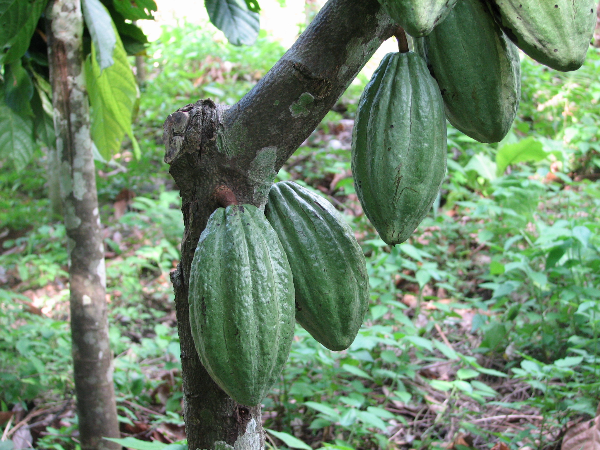
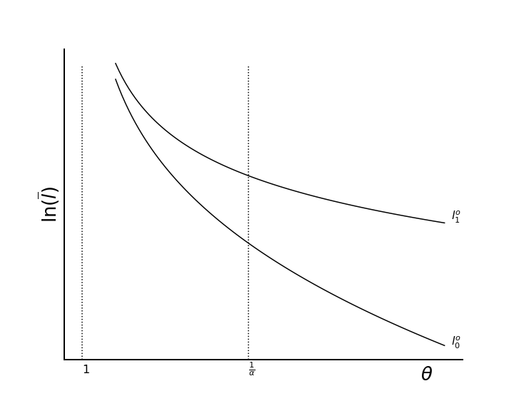
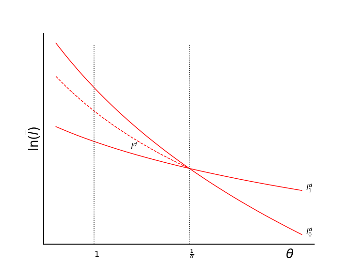
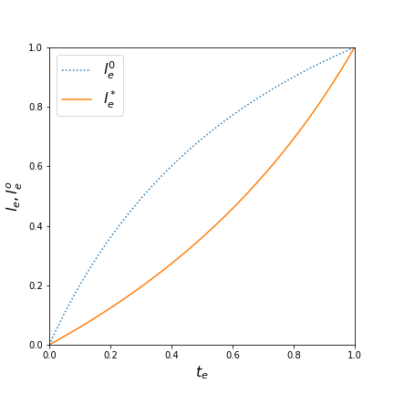
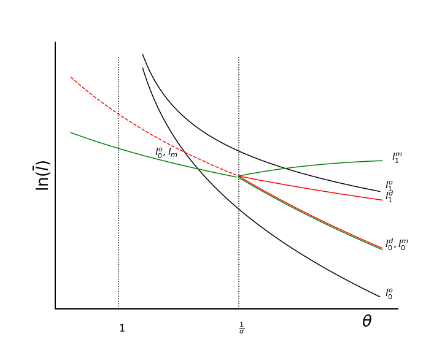

# Customary Tenure and its Transformation

## Elements of a Conceptual Framework 

**Matthew J. Baker** and **Jonathan Conning**

---

## Outline

- Some stylized facts (rough)

- A GE [framework](https://drive.google.com/file/d/1c4QCvBV8MbPocEWKMZzhSvtQ4gS-AZSv/view?usp=sharing) for studying customary tenure and its transformation
  - Efficiency
  - Distribution and Conflict
  - Policy and Coordination

---

## Land in Africa

- Historically land abundant region
  - 1/2 of world's uncultivated lands
  - Vast mineral and natural resources
  - Natural Habitats and wildlife 
- Vast heterogeneity of situations on a vast continent

---

### Mounting Opportunities and Challenges
  - Rising pressure on land: population, new technologies, market access
  - Low yields; soil degradation; climate change
  - Large measured misallocation within and across sectors (large APGs)
  - Limited access, insecurity by
    - women, young, pastoralists, and other weak stakeholders
    - more productive locals and outside investors   
  - Weak often overlapping land governance institutions 
  - Scramble for rights; land grabbing; government expropriation 
  - rapid unplanned urbanization 

    
---

### Customary tenure and its transformation
  - Initially evolved in conditions of land abundance, but adaptable
    - Inheritable household use-rights but limits on rights to alienate land
  - Shaped by colonial policies
    - Ghana: British incorporated customary law
    - Cote d'Ivoire: French declared all 'unused' land state property
    - ZA: limit smallholder access to land to limit competition and control labor 
  - Adaptable in some conditions, not others
    - Weak/overlapping systems for land governance
    - Often clientelistic politics

---
### Ghana
(Hill, 1963; Bubb 2013; Goldstein and Udry (2008), Onoma (2009))
- Ashanti/Akan lands vested in the community.
- Symbolized by ceremonial stool on which chief sat. 
- British indirect rule delegated authority to chiefs. 
- Use rights from clearing and cultivating unclaimed land. Lineage head allocated rights. among members ("The farm is my property, the land is the chief's").
    - use rights passed to heirs matrilineally.
    - land reverts to community when HH stops cultivation.

---

### Ghana

Adaptation and transformation
  - Spontaneous/negotiated enclosure.  Migrant 'capitalist' farmers negotiated with Akim chiefs to enter and purchase lands. Cocoa boom of late 19th and early 20th century (Hill)
  - Lands bought and sold, upheld by courts, became inheritable individualized.

---

### Ghana:

Failure to adapt
  - Onoma (2009): Ga and other traditional Ghanian chiefs "selling the same piece of land multiple times." 
  - Botswana vs Ghana: "ways in which elites extract value from land.. preference for strong institutions or ... no such interest in securing property rights."

---

## Urban

- Rapid urbanization (often without growth); mega-cities
- Usually unplanned, informal conversion of lands
- Individualized property, active transactions but many problems:
  - insecurity, multiple sales
  - lack of planning
  - weak, costly mechanisms for arbitration
  - fears of expropriation
- Poverty and Inequality

---

## Rising land values and the rush to 'enclose'

- Scramble for PRs as reality or perception of rising land values.
- 'Land grabs' by local or outside elites
  - rush to establish new 'formal' land claims can extinguish customary claims, particularly weak stakeholders
    - women
    - pastoralists
    - more recent arrivals

---

## Mixed success in Policy Reforms

- Efforts to build on customary land tenure
  - certificates of village lands, certificates of customary rights of occupancy
  - Often not full transferable rights
  - Limited take-up
- Reform aims to protect women, weak stakeholders, build institutions for land administration and governance 
   - but may trigger opportunities for elite capture
   - Slow takeup in some areas
   - 'certificates' often provide only restricted rights

---
## Samuelson's 1974 Question: 
>Is the Rent-Collector Worthy of his full hire?

- Modern phrasing: will enclosing land raise the poor's wages/incomes?

   - potentially reduces misallocation within and across sectors
   - potentially raises productivity directly

Answer more complicated than might appear.  
- poor might lose use-rights once held
- private encloser's incentives may diverge from social
   -  may 'expel' labor in ways that lower wages
- enclosure involves resource costs
  

We build a model to examine such tradeoffs.

---
 
## The transformation of customary tenure
- Not new nor unique to Africa.
- English Enclosures swept away open fields, customary communal tenure
  - 800 year process; 
  ~900 Parliamentary Acts
 - Charged debates: 
   - path to agrarian capitalism and structural transformation and/or dispossesion and theft?

---
### Historical Debates
Robert C. Allen argues 'Tory'and 'Marxist' share *'Agrarian Fundamentalism'* views that: 

- 'Traditional' peasant farms, open fields/communal tenure 'stifled' progress.
- That enclosures led to: 
  - larger, 'more productive' and 'modern' farms
  - private property, lease markets, commercial attitudes, wider markets
- That this 'released' labor and resources for industrialization
    - Tory view: agricultural productivity gains and pop growth 'pushed'
    - Marxist view: enclosure dispossed peasants of land rights, lowered wages  

---

**Challenges to Agrarian Fundamentalism Views** (Allen, 1992):
- Small yeoman farmers achieved similar yields, productivity gains.
  - Consistent with evidence around world similar at least through 90s that family farms competitive (BDF 1995)
- Early English enclosures (thru 17c) strengthened *peasant* property.
- Later 18th & 19th century enclosures a 'landlord revolution' 
  - raised investment productivity in some districts, but not others.
  - rising rents redistributed income from farmers to landlords.
  - land speculation, discriminatory land policies squeezed out smaller farmers
  - productivity gains 'mainly due to declines in farm employment'
- Different paths to agrarian capitalism: 
    -Japanese, American paths, demonstrate paths with less inequality.

---

## Misallocation Studies
- Large econ lit has studied misallocation on land and labor and determinants of agrarian structures (size distribution of farms) both in GE theory and empirically. 
- Distortions from combination of: insecure property rights, credit rationing, moral hazard in labor supervision (span of control), market power and coercion. 
- Classic early survey: 
  
>Binswanger, HP, K. Deininger, and G Feder. 1995. “Power, Distortions, Revolt and Reform in Agricultural Land Relations.” *Handbook of Development Economics* 3: 2659–2772.

 - Evidence of missing activity/misallocation in land markets

- Evidence of mixed impact of land property rights reforms   

---

**Recent 'macro' papers on misallocation due to 'customary tenure'**
- Adamopoulos & Restuccia (2014); Restuccia & Santaeulalia-Lopis (2017); Chen (2017), Gottlieb & Grobovske (2019), others.

- All suggest *very large* misallocation due to distortions arising from land ceilings, 'communal land' and other restrictions.  

- Gollin & Udry (2019) argue for greater care in measurement error, heterogeneity. Reduce estimated productivity gains from 'reforms' from >200% to closer to 10%.

None of these models explain property rights insecurity or the enclosure process.  
- They just pretend magic wand wave would 'fix' land rental/sale markets.
- Say nothing of transition dynamics nor redistribution impacts or battles from transforming customary tenure.
- Need richer models.

---

### General Equilibrium with insecure land property rights
**Models of Enclosure**
- Weitzman (1974); Samuelson (1974); Cohen & Weitzman (1975)
de Meza and Gould (1987; 1992)

**Models of endogenous PRs and conflict**
- Garfinkel & Skaperdas (1996 survey); Hirshleifer (1988); Grossman (1994); Baker (2003); Conning & Robinson (2007); Jimenez (1984); Brueckner and Selod (2009)

Market frictions leading to misallocation:
- Non-alienability, tenure insecurity.
- asymm info/costly enforcement in credit/risk;  labor supervision, market power, coercion.
- With standard technologies more than one factor market must fail for inefficiency

---

## A Framework for analyzing Customary tenure and its transformation: 
(Baker/Conning, 2020; Samuelson (1974); Cohen/Weitzman (1975); deMeza/Gould, 1992)

- GE with land and labor; varying intensity of production
- imperfect alienability of customary tenure: 'use it or lose it'
- decentralized, privately costly 'enclosure' decisions:
   - allow 'owner-claimant' to exclude (and/or move w/o fear of PR loss)
   - may raise agricultural productivity 
  -  may have redistributive ('land grab') as well as productive purposes

---

#### Anaylsis and Results Highlights
- Spillovers, complementarities and coordination failures in enclosure decisions
- Depending on pop density $\bar l$, productivity gain $\theta$, other parameters:
   - **Inefficiently low enclosure:** 
   Stuck in low-productivity customary tenure eqa. with misallocation
   - **Inefficiently high enclosure**: 
   Inefficient scramble for property rights, rise in inequality
   - **Efficient level of enclosure**
 - We compare socially efficient, decentralized private, and monopoly enclosure

---
### Agricultural production and property regime
- agriculture sector (inelastic labor supply) first to motivate, later add manufacturing 

- **Unenclosed/Communal lands** - labor earns value average product $APL_C$
- **Enclosed lands** - owner/claimant that pays $c$ per unit land to enclose can exclude others.
  - will use/hire labor intil value marginal product $MPL_E$ equals wage.
  - Possible productivity gains, $\theta$, via adoption of new methods/technologies.
### Production
$$
F(T,L) =\ \ \ \ T^{1-\alpha}L^\alpha \\
G(T,L) = \theta \cdot T^{1-\alpha}L^\alpha
$$

---
### Communal Lands Interpretation
No need to characterize unenclosed as 'sharing economy' governed by custom. 
By Euler's Theorem:
$$
APL_C = MPL_C + MPT_C \cdot \frac{T}{L}  \\
p \cdot APL_C = W_C + r_C \cdot \frac{T}{L}  \\
$$
APL interpreted as competitively priced community wage plus rents from use-rights.
- **Misallocation** interpreted as fear of loss of use-rights if move:
$$
MPL_E = w_F = APL_C =  w_C + r_C \cdot \frac{T}{L} \ge w_C
$$
---

---

---
- $\bar T$, $\bar L$ labor and land supply
- $\bar l = \frac{\bar L}{\bar T}$ population density
- $T_e$,$L_e$ total land, labor in enclosed sector.  
- $t_e=\frac{T_e}{\bar T}$ share of enclosed lands
  
- A useful decomposition:
$$
G(T_{e},L_{e}) =t_e^{1-\alpha} \bar l_e ^{\alpha} \cdot \theta \bar T^{1-\alpha} \bar L ^{\alpha}\\
=F(t_e,l_e)\cdot \theta F(\bar T, \bar L)
$$

- $F(t_e, l_e)$ is fraction of *potential* output for given land/labor enclosed

---
## Optimal Enclosure 
- Enclosure: potential to raise productivity with $\theta$
- worthwhile only if benefits exceeds costs $c$

$$
\max_{t_e,l_e} \left[\theta\cdot F(t_e,l_e)+F(1-t_e,1-l_e)\right ]\cdot F(\bar T, \bar L) -cTt_e
$$
- For given $t_e$, find optimal 
$$
l_e^o(t_e) = \frac{\Lambda^ot_e}{1+(\Lambda^o-1)t_e}, \text{  where }\Lambda^o=\theta^{\frac{1}{1-\alpha}}
$$
- then find $t_e^*$
---
## Optimal Enclosure
Depending on pop. density $\bar l$, expected productivity gains $\theta$, enclosure cost $c$, and other paramters, three cases:
- Enclose all
- Enclose none
- Partial Enclosure 

Observations: 
- Establishing costly PRs worthwile only w/ higher $\bar l$ or $\theta$, lower $c$ (Boserup)
- With partial enclosure efficient to operate enclosed lands more labor-intensively.  

---

---
## Private decisions to enclose
- owner-claimants independently and simultaneously decide to enclose each unit of land
  - compare expected private rent per unit $r(t_e)$ to enclosure cost $c$
  - mix of productivity gain ($\theta$), redistribution gain; ignores spillovers. 
- labor moves across enclosed and unencloaed (and manuf) sectors to equalize wage
-  misallocation $MPL_e=w=APL_c>MPL_c$ 
   -  'too little' labor on enclosed lands
   -  'too much' labor ('crowding') on unnclosed lands
   -  there are spillover and strategic complementarities in enclosure decisions

---

## Equilibria with decentralized Private enclosure decisions
- Four possible equilibirium regimes, depending on parameters:
   - Unique Nash Equilibria where either: 
     1. All enclose
     2. None Enclose
     3. Partial Enclosure

 - or Multiple Equilibria (coordination games) where:
     - All enclose
     - None enclose 
    - We can use Global Games to guide equilibrium selection. 
---

## Private enclosure decisions
- dashed line: global games partition
- full enclosure: above $l^d$ and $l_1^d$ 
- no enclosure: below $l^d$ and $l_0^d$ 
- partial enclosure: between $l_0^d$ and $l_1^d$ 

Private enclosure even when $\theta<1$!
(redistribution gains over production gains)
Compare to Optimal in next graph

---

Private enclosure may or may not improve efficiency

Possible outcomes:
- **Inefficiently high enclosure**
- **Inefficiently low enclosure**
- **Efficient enclosure**

---
### Does enclosure raise or lower employment and wages?
- Social $l^o_e(t_e)$ vs private $l^*_e(t_e)$
- Optimum to use *higher* labor intensity on enclosed lands.
- For $\theta<\frac{1}{\alpha}$ private enclosers use 
  - *less* labor per unit land.
  - leads to 'crowding' on unenclosed lands
  - Equilibrium wage falls 
  

---
## What if reforms assign claims to existing use-right holders?
- Eliminates/reduces redistribution element
- But same private benefit/cost calculation ($r^*(t_e)>c$)
- Reduces own employment on own now-enclosed lands
  - spills onto not yet enclosed lands 
     - a free-rider problem of sorts. 

---

## Extensions
- 'Monopoly' and 'village syndicate' enclosure 
- Manufacturing sector
  - Inter-sectoral as well as intra-sectoral misallocation
- Heterogeneity in non-traded farming skills
  
---
## Monopoly encloser
- Internalizes spillovers
- But manipulates land rental prices

- At lower $\theta<\frac{1}{\alpha}$
   - pushes *more* land into inefficient enclosure
 - At higher $\theta>\frac{1}{\alpha}$
   - inefficiently holds land back from efficient enclosure

---

## Some Policy Points

- Most Policy: reduction of $c$ - easier titling, technology like barbed wire.
- Enclosure can improve efficiency under the right conditions, whether monopolized or decentralized
- Enclosure can cause a welfare-reducing reduction in land intensity and worsen the distribution of income between owners and labor under the wrong conditions
- 'Wrong conditions' more likely where severe land/labor pressure and enclosure technology does not include higher relative TFP 

---

---

## Some Relevant Case studies

- Bauer (2005), Bauer and Nyima (2011) - Tibet
- Wairore et al (2015) - Chepareria, Kenya
- Graham (1988) - Somalian experience in 1980s
- Nyberg et al (2015) - West Pokot, Kenya
- Kenee (2008), Napier and Desta (2011) - Eastern Ethiopia
- Behnke (1985) - South Darfur

---
## Notes Bauer (2005):
With stated aim to increase agricultural output: "Privatization policies were designed to turn Tibet’s communal, extensive rangeland grazing system into industrialized ranch-based production that relies on enclosed pastures, grows fodder, feeds animals in stalls, and delivers meat to ready markets."

There was also allegedly a tragedy of the commons - degradation of rangelands - and population growth. Chinese government sought both an institutional and technological solution to this problem. Encouragement of barbed wire usage by government.

---
Notes from Wairore et al (2015):

---
## Notes from Graham (1988):

"Spontaneous enclosure" in Somalia-Sanaag-Central Galagud, with a "land panic" and "The rapidity with which this has occurred has obviously suprised many people." Also: "One result of this enclosure has been an increase in overgrazing..." 

"Enclosure can therefore be expected to produce large numbers of dispossed people whose future will depend upon the ability of the economy to absorb a new labor force." Also notes wealth stratification.

Here, $\theta<\Lambda$

---
### Notes from Nyberg et a l (2015):

Cites common property problems and enclosures as a response over a 30-year period. Tenfold population increase over the last 50 years. In the 1980s, gradual introduction. Livelihood changes and agribusiness on enclosed land. At least we know that there is a $\theta \neq 1$, as the technology is different!

---
### Notes from Kenee (2008):

State support for enclosure, but "expansion does not generally increase the welfare of (agro-) pastoral community in the longer-term as it is causing extensive rangeland degradation..."

Note to self: a great list of citations in this paper...
---
Notes from Behnke (1985):
Documents two cases from the same area with zones A and B. Zone A: fodder for commercial use value increased( movement to right on our graph?). Zone B: overuse encouraged enclosure (movement up on our graph?). 

Some additional sources in this on Australian and the Western United States.

---
Notes from Napier and Desta (2011):

---
